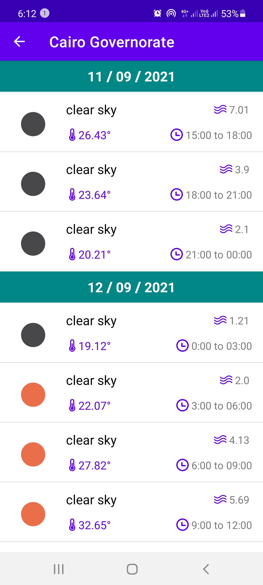

# Weather Android App 
A simple app that hits "https://openweathermap.org" API and show a current weather details for specific cities,
that user entered or get a forecast ( 5 days 3 hours ) for current city by enable locationn access

### Demo
<table>
  <tr>
   <td> </td>
   <td> </td>
   <td> </td>
</tr> 
</table>

## Installation
    $ git clone https://github.com/mahmoud-elshahat/WeatherAndroidApp.git

## Run the coverage reports
`./gradlew createDebugCoverageReport` and report will be generated in `/build/reports/coverage/debug`

## Built With 🛠
- [Kotlin](https://kotlinlang.org/) - First class and official programming language for Android development.
- [Coroutines](https://kotlinlang.org/docs/reference/coroutines-overview.html) - For asynchronous and more.
- [Android Architecture Components](https://developer.android.com/topic/libraries/architecture) - Collection of libraries that help you design robust, testable, and maintainable apps.
  - [LiveData](https://developer.android.com/topic/libraries/architecture/livedata) - Data objects that notify views when the underlying database changes.
  - [ViewModel](https://developer.android.com/topic/libraries/architecture/viewmodel) - Stores UI-related data that isn't destroyed on UI changes.
  - [ViewBinding](https://developer.android.com/topic/libraries/view-binding) - Feature that allows you to more easily write code that interacts with views.
- [Retrofit](https://square.github.io/retrofit/) - A type-safe HTTP client for Android and Java.
- [Glide](https://github.com/bumptech/glide) - For Loading images from Urls.
- [Location](https://developer.android.com/reference/android/location/Location) -  request the last known location of the user's device
- [Facebook Shimmer](https://github.com/facebook/shimmer-android) -  Android library that provides an easy way to add a shimmer effect to any view in your Android app.
- Testing
  - [UI Tests](https://en.wikipedia.org/wiki/Graphical_user_interface_testing) ([Espresso](https://developer.android.com/training/testing/espresso))
  - [UNIT Tests](https://developer.android.com/training/testing/unit-testing)  generally exercises the functionality of the smallest possible unit of code
  - [MockK](https://mockk.io/)  mocking library for Kotlin
- Architecture
  - MVVM Architecture (Model - View - ViewModel)
  - Clean Architecture approach.

